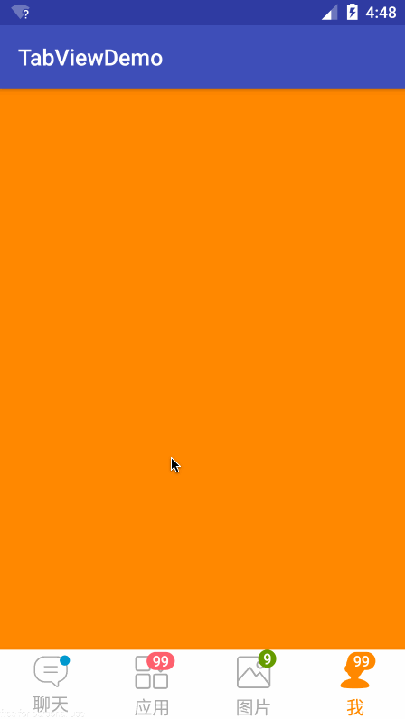

# Android TabView
[  ](https://bintray.com/isanwenyu/maven/TabView/_latestVersion)
[](http://developer.android.com/index.html)
[](https://www.apache.org/licenses/LICENSE-2.0)

Android首页底部常用tab切换控件

## Features
- TabViews in TabGroup only one can be checked
> TabGroup 参考 RadioGroup api基本一致 <br>
> TabView 参考 CompoundButton 实现 checkable 

- Support badge view for reminding
> BadgeView is from [https://github.com/liyanxi/BadgeView ](https://github.com/liyanxi/BadgeView ).All its attributes can also apply in the tabview.

- Support water ripple effect when it's clicked
> Water Ripple View is from [https://github.com/isanwenyu/RippleEffect](https://github.com/isanwenyu/RippleEffect). TabView inherit from RippleView so all its attributes can also apply in the tabview.

- Support chain API 
> Implement BadgeViewControl and RippleViewControl interface support chain API.

## Quick Overview


## Getting Started

 - Add the dependency to your build.gradle.
 
```
dependencies {
 	compile 'com.isanwenyu.tabview:tabview:1.2.3'
}
```
- Maven:

```
<dependency>
  <groupId>com.isanwenyu.tabview</groupId>
  <artifactId>tabview</artifactId>g
  <version>1.2.3</version>
  <type>pom</type>
</dependency>
```


## Usage
- xml

```

    <com.isanwenyu.tabview.TabGroup
        android:id="@+id/tg_tab"
        android:layout_width="match_parent"
        android:layout_height="wrap_content"
        android:background="@android:color/white"
        android:elevation="10dp"
        app:checkedTab="@+id/tab_chat">
        
		......

        <com.isanwenyu.tabview.TabView
            android:id="@+id/tb_user"
            style="@style/TabView"
            app:badge_color="@android:color/holo_orange_dark"
            app:badge_count="888"
            app:badge_none_show="true"
            app:badge_padding_right="@dimen/tab_img_container_padding"
            app:badge_padding_top="@dimen/tab_img_container_padding"
            app:imgContainerPadding="@dimen/custom_img_container_padding"
            app:imgDrawable="@drawable/tab_user"
            app:imgMargin="@dimen/tab_img_margin"
            app:rv_centered="true"
            app:rv_color="@android:color/holo_orange_dark"
            app:rv_framerate="20"
            app:rv_rippleDuration="100"
            app:rv_zoom="true"
            app:rv_zoomDuration="200"
            app:rv_zoomScale="1.2"
            app:textColor="@color/tab_user_text_selector"
            app:textSize="@dimen/tab_view_text_size"
            app:textString="我" />
    </com.isanwenyu.tabview.TabGroup>
```

- code

```

        //init tab badge view && ripple view,the others setted in activity_main.xml
        mChatTabView
                .setBadgeColor(getResources().getColor(android.R.color.holo_blue_dark))
                .setmDefaultTopPadding((int) TypedValue.applyDimension(TypedValue.COMPLEX_UNIT_DIP, 2, getResources().getDisplayMetrics()))
                .setBadgeShown(true)
                .setTabRippleCentered(false)
                .setTabRippleColor(android.R.color.holo_blue_dark)
                .setTabRippleDuration(100)
                //override setOnRippleCompleteListener method in rippleView
                .setOnRippleCompleteListener(new RippleView.OnRippleCompleteListener() {
            @Override
            public void onComplete(RippleView rippleView) {
                mChatTabView.setChecked(true);
            }
        });
        ((TabView) mTabGroup.getChildAt(1)).setBadgeCount(999)
                .setmDefaultTopPadding((int) TypedValue.applyDimension(TypedValue.COMPLEX_UNIT_DIP, 2, getResources().getDisplayMetrics()))
                .setBadgeShown(true)
                .setTabRippleEnable(false);
```

## Todo

 ~~加入中央仓库~~ <br>
 ~~添加红点标识~~ <br>
 ~~添加点击水波纹效果~~
 
## Dependencies
- [https://github.com/liyanxi/BadgeView](https://github.com/liyanxi/BadgeView) 徽章控件 显示数字提醒 小红点
- [https://github.com/isanwenyu/BintrayUploadGradle](https://github.com/isanwenyu/BintrayUploadGradle) 上传repo到bintray并添加到JCenter的gradle脚步库
- [https://github.com/isanwenyu/RippleEffect](https://github.com/isanwenyu/RippleEffect) support water ripple effect 

## License

    Copyright 2016 isanwenyu@163.com

    Licensed under the Apache License, Version 2.0 (the "License");
    you may not use this file except in compliance with the License.
    You may obtain a copy of the License at

       http://www.apache.org/licenses/LICENSE-2.0

    Unless required by applicable law or agreed to in writing, software
    distributed under the License is distributed on an "AS IS" BASIS,
    WITHOUT WARRANTIES OR CONDITIONS OF ANY KIND, either express or implied.
    See the License for the specific language governing permissions and
    limitations under the License.
